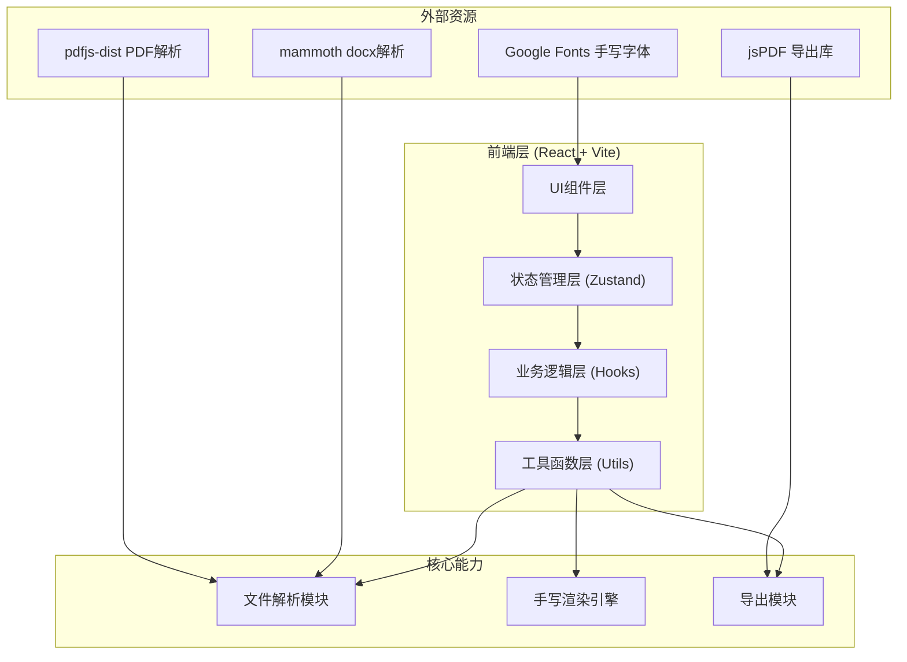

## 1. 架构设计



## 2. 技术描述
- **前端**：React@18 + TypeScript + Vite@5
- **样式方案**：TailwindCSS@3 + CSS变量主题系统
- **状态管理**：Zustand
- **路由**：react-router-dom（单页面应用，主要为工作台）
- **初始化工具**：vite-init
- **后端**：无（纯前端应用，所有逻辑在浏览器端完成）

### 核心依赖库
- `mammoth` — 解析 .docx 文档提取纯文本
- `pdfjs-dist` — 解析 .pdf 文档提取纯文本
- `jspdf` — 将Canvas内容导出为PDF文件
- `lucide-react` — 图标库
- `html2canvas`（可选，备选方案）

## 3. 目录结构

```
src/
├── components/
│   ├── layout/
│   │   ├── Header.tsx          # 顶部导航
│   │   └── WorkspaceLayout.tsx # 三栏工作区布局
│   ├── upload/
│   │   └── FileUploader.tsx    # 文件上传组件
│   ├── editor/
│   │   └── TextEditor.tsx      # 文本编辑区
│   ├── settings/
│   │   ├── FontSettings.tsx    # 字体设置面板
│   │   ├── PaperSettings.tsx   # 信纸设置面板
│   │   └── LayoutSettings.tsx  # 排版设置面板
│   ├── preview/
│   │   ├── HandwritingPreview.tsx  # 手写预览Canvas
│   │   ├── Pagination.tsx      # 分页控制
│   │   └── ZoomControls.tsx    # 缩放控制
│   └── export/
│       └── ExportActions.tsx   # 导出操作栏
├── hooks/
│   ├── useFileParser.ts        # 文件解析逻辑
│   ├── useHandwritingRender.ts # 手写渲染逻辑
│   └── useExport.ts            # 导出逻辑
├── store/
│   └── useWorkspaceStore.ts    # 全局状态（文本、配置等）
├── utils/
│   ├── fontPresets.ts          # 手写字体预设配置
│   ├── paperPresets.ts         # 信纸样式预设
│   ├── textUtils.ts            # 文本处理工具
│   └── canvasUtils.ts          # Canvas绘制工具
├── types/
│   └── index.ts                # 全局类型定义
├── pages/
│   └── Workbench.tsx           # 工作台主页面
├── App.tsx
├── main.tsx
└── index.css
```

## 4. 核心数据模型

### 4.1 工作区状态 (WorkspaceState)
```typescript
interface WorkspaceState {
  rawText: string;                    // 原始文本内容
  fileName: string;                   // 当前文件名
  config: HandwritingConfig;          // 手写配置
  currentPage: number;                // 当前预览页
  zoom: number;                       // 缩放比例
  isProcessing: boolean;              // 是否处理中
  
  setText: (text: string, fileName?: string) => void;
  updateConfig: (patch: Partial<HandwritingConfig>) => void;
  resetConfig: () => void;
  setPage: (page: number) => void;
  setZoom: (zoom: number) => void;
}
```

### 4.2 手写配置 (HandwritingConfig)
```typescript
interface HandwritingConfig {
  font: {
    family: string;           // 字体族名
    size: number;             // 字号 px
    color: string;            // 墨色 hex
    weight: number;           // 笔画粗细 300-700
    jitter: number;           // 字迹抖动程度 0-1
  };
  paper: {
    type: PaperType;          // 信纸类型：blank/line/grid/kraft
    bgColor: string;          // 纸张背景色
    lineColor: string;        // 线条颜色
    lineSpacing: number;      // 行间距 px
    showMargin: boolean;      // 是否显示装订线
  };
  layout: {
    pageWidth: number;        // 页面宽度 px
    pageHeight: number;       // 页面高度 px
    paddingTop: number;
    paddingRight: number;
    paddingBottom: number;
    paddingLeft: number;
    letterSpacing: number;    // 字间距 px
    lineHeight: number;       // 行高倍数
    paragraphSpacing: number; // 段间距 px
  };
}
```

## 5. 关键技术实现要点

### 5.1 文件解析流程
- TXT：FileReader.readAsText() 直接读取，处理UTF-8/BOM
- DOCX：mammoth.extractRawText({ arrayBuffer }) 获取纯文本
- PDF：pdfjs-dist getTextContent() 按页合并文本
- 解析失败降级：允许用户直接粘贴/输入文本

### 5.2 Canvas手写渲染
- 文本按排版规则分页计算（先测量再绘制）
- 使用 Canvas 2D API，fillText 逐字绘制
- 加入随机微偏移模拟手写不平整（jitter参数控制）
- 轻微旋转角度、笔画粗细波动增强真实感
- 信纸背景使用 Canvas 图案叠加 + CSS 纹理

### 5.3 手写字体方案
- 使用 Google Fonts 中的手写风格字体，通过 @font-face 引入
- 内置字体预设：Ma Shan Zheng（中文手写）、Zhi Mang Xing（行楷）、Liu Jian Mao Cao（草书）、Caveat、Patrick Hand、Dancing Script 等
- 字体加载完成前显示加载状态

### 5.4 导出实现
- PNG：Canvas.toBlob() 生成图片，a[download]触发下载
- PDF：jsPDF new jsPDF({ unit: 'px' })，addImage()将Canvas逐页加入
- 多页PDF：循环每页Canvas，调用addPage()后addImage()
